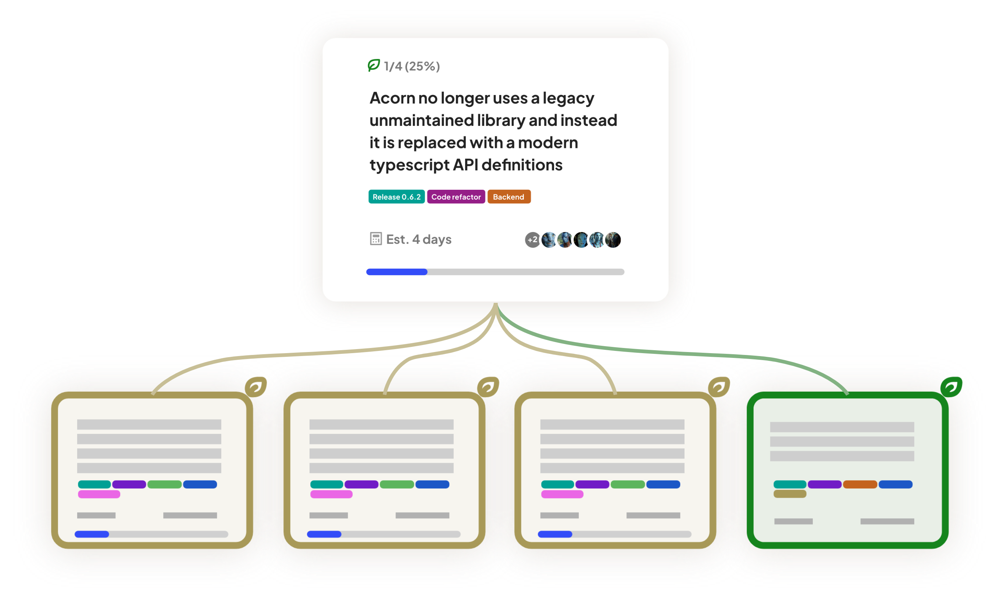

# Best Practices


This page is under development.


## Getting started with your project in Acorn

### Starting with the highest level intended Outcomes

Acorn focuses on desired and intended [Outcomes](the-ontology-of-acorn.md#outcomes) instead of goals. What it means for you and your team is that when you start a project in Acorn you would want to start with writing down the highest level Outcome or Outcomes for your project in **declarative** sentence (we call this an [Outcome Statement](../outcomes/outcome-statement.md)). For example, one of the highest level Outcomes that we want to achieve for the Acorn software project would be:&#x20;

> Software dev teams have a seamless and frictionless experience doing project management using Acorn.

<figure><figcaption>
An example of a highest level Intended Outcome, viewed in Expanded View
</figcaption></figure>

### Breaking down the Outcomes

At first any intended Outcome is **Uncertain** in [Scope](the-ontology-of-acorn.md#outcome-scope): It's not clear how long it is going to take, how it could be achieved, or who should work on it for it to get achieved.&#x20;

So you would need to break down your highest level Outcome(s) into smaller scoped Outcomes. You would need to ask yourself:&#x20;

* What Outcomes do we need to achieve first to consider the highest level Outcome achieved?
* What's our Hypothesis for breaking down the Outcome in a specific way?&#x20;

You will then need to add [Children Outcomes](../project-views/map-view/outcome-connections.md) to the Outcome you are breaking down. That's where the dependency relationship between Outcomes comes into play, modelled as a [**Dependency Tree**](the-ontology-of-acorn.md#dependency-tree) of Outcomes in Acorn (visible in [Map View](../project-views/map-view/)).

This Breakdown process might take you or your team some time. This allocation of time and focus is accounted for in Acorn. When you are in the process of breaking down an Uncertain scope Outcome mark it as **In Breakdown** mode. You can also give it a [**Breakdown Time Estimate**](../outcomes/time.md#time-for-uncertain-scope-outcomes) for how long it could take you to break down that Outcome into Small Scoped Outcomes (shown as the Children and/or [Descendants](../project-views/map-view/outcome-connections.md) of that Outcome). You can also define who is doing this Breakdown by [assigning](../outcomes/assignees.md) them to that Outcome.

<figure><figcaption>
Breaking down the Outcomes in the Dependency Tree to reach to the level of <a href="the-ontology-of-acorn.md#small-scope">Small Scope Outcomes</a>. If an Outcome only has Small and/or Big Scope Children it automatically shifts from Uncertain to Big in Scope.
</figcaption></figure>

### Creating a Dependency Tree of Outcomes

Keep breaking down each Outcome till you can confirm the lowest [Child Outcome](../project-views/map-view/outcome-connections.md) in each branch is clear in Scope and can be achieved within a short amount of time (right now this is automatically set as 1 day in Acorn). These Outcomes are [**Small in Scope**](the-ontology-of-acorn.md#small-scope), and you can mark them as such by opening the [Expanded View](../project-views/expanded-view.md) of that Outcome and switching the Scope to Small.&#x20;

<figure><figcaption>
An example of a Dependency Tree of a project seen in <a href="../project-views/map-view/">Map View</a>. The Outcome on the top is the highest level Outcome.
</figcaption></figure>

<figure><figcaption>
An example of a <a href="the-ontology-of-acorn.md#small-scope">Small Scope Outcome</a>, viewed in Expanded View
</figcaption></figure>

### Modifying the Dependency Tree

Acorn is meant to be an agile project management methodology. It means that as you progress through developing your project, your Dependency Tree would evolve or change. Acorn is designed to accommodate these iterations. For example, at some point you might realize you have a different highest level Outcome for your project, and you can modify your Dependency Tree of Outcomes accordingly. [Learn how to add or change the connections between Outcomes](../project-views/map-view/outcome-connections.md).

## Your team's day-to-day workflow

Now that you've broken down your tree in Map View and it has grown large enough with some Small Scoped Outcomes available, you may begin to think about where to start. Here are some tips:

### Picking and ranking project priorities

The team member or members in project management hat would **mark** certain Outcomes in the Dependency Tree as [High Priority](../outcomes/high-priority-outcomes.md).&#x20;

Then they have to **sort** between those High Priority Outcomes in [Priority View](../project-views/high-priority-view.md) to rank them.&#x20;

If an Outcome marked as High Priority is:

* **Uncertain Scope with Children**
  * It needs to be broken down until all of its lowest level [Descendants](../project-views/map-view/outcome-connections.md) are Small in Scope.
* **Uncertain Scope without Children**
  * The priority for it is[ breaking down](best-practices.md#breaking-down-the-outcomes) that Outcome.
  * Make sure there is relevant team member (or members) [assigned](../outcomes/assignees.md) to breaking down the Outcome.
* **Small Scope:**&#x20;
  * It needs to be [assigned](../outcomes/assignees.md) to related team member or members
  * Have a [Tasklist](../outcomes/tasklist.md) created for it.&#x20;
  * You can also add a [Target Date](../outcomes/time.md#time-for-small-scope-outcomes).

### Achieving Small Scope Outcomes

The team members in 'doer' hat (those who execute to achieve Small Scope Outcomes) will be able to access the Outcomes assigned to them via the [Table View](../project-views/table-view.md) and using the filter '**Only show my cards**'.

They can also view the High Priority Outcomes in [Priority View](../project-views/high-priority-view.md) and see which ones they are assigned to.


In the future we are intending to have the '**Only show my cards**' filter for the Table View as well.


#### Going through the Tasklist

If the Small Outcome already has [Tasklist](../outcomes/tasklist.md) added to it by the members in Project Management hat then the Assignee can go through those tasks and check them off as they complete each task. The Assignee also can create a Tasklist for themselves to help them break down the steps to Acheive that Small Scope Outcome.

Checking off each task in the Tasklist updates the [Progress Indicator](../outcomes/progress-indicator.md) for that Outcome. When all of the tasks are checked off the Outcome automatically turns into **Achieved** Status. If for any reason it is determined that the Outcome is not achieved yet, you can manually switch the [Achievement Status](../outcomes/achievement-status.md) back to **Not Achieved**.

<figure><figcaption>
An example of the Tasklist for a Small Scope Outcome, viewed in Expanded View
</figcaption></figure>


If you achieve all the Small Scope Outcomes that are Children and/ore Descendants of a Big Scope Outcome, then the Parent Outcome automatically becomes Achieved.&#x20;


### Connecting Outcomes with Your GitHub Repository

Acorn is designed with project management for distributed software teams in mind. There is a GitHub Issue or Pull Request link option that you can add to any Outcome. This will help you and your team cross reference between your GitHub repo and your Acorn space.&#x20;

#### Translating a GitHub Issue to an Outcome

What could be very useful for project management of a software product is translating GitHub issues into Outcomes in Acorn. This will help you make a cohesive understanding of where the external feedback belongs in the bigger picture of your project's Dependency Tree.

For example, we received the issue below on GitHub:

<figure><figcaption>
An example of an Issue on a the GitHub repo for the project
</figcaption></figure>

Then, we translate it into an intended or desired Outcome and [link the GitHub Issue](../outcomes/github-link.md) to it:&#x20;

<figure><figcaption>
An example of a GitHub Issue translated into an Outcome on Acorn
</figcaption></figure>

Then we look into whether this Outcome speaks to a bigger Outcome we want to achieve for our project. For example, this Outcome helps us with achieving a bigger scoped Outcome:&#x20;

> App functions normally and without interruption in terms of connectivity.

So we make the recently created Outcome a [Child](../project-views/map-view/outcome-connections.md) of the bigger scope Outcome:

<figure><figcaption>
An example of the newly created Outcome becoming a Child of a bigger scope Outcome
</figcaption></figure>
