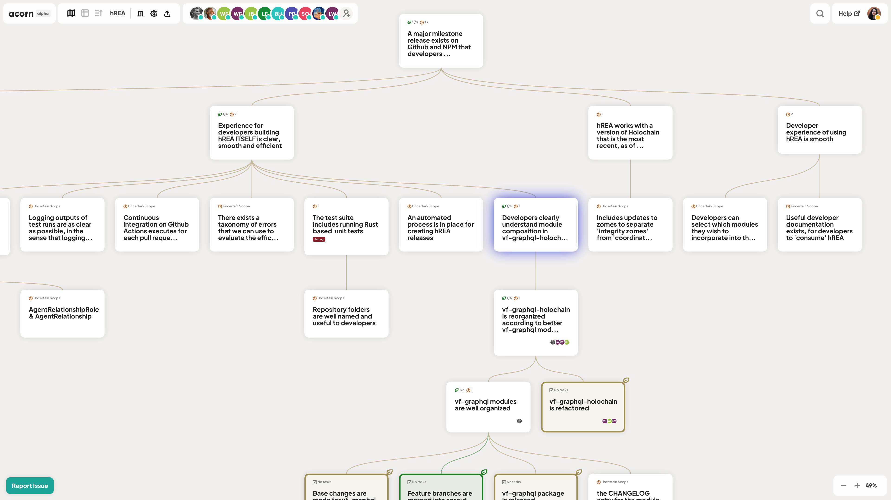

# The Ontology of Acorn

## Outcomes

In the Acorn ontology projects are managed through the lens of Intended Outcomes, their [dependencies](the-ontology-of-acorn.md#dependency-tree), [Scope](the-ontology-of-acorn.md#outcome-scope) and [Achievement Status](the-ontology-of-acorn.md#achievement-status) in a [Plan-Do-Check-Act Cycle](the-ontology-of-acorn.md#plan-do-check-act-cycles) process.

Instead of a title, an Outcome is defined through an **Outcome Statement**, demonstrating a desired state in the project in declarative. For example:

> Acorn no longer uses a legacy unmaintained library and instead it is replaced with a modern typescript API definitions.


An Outcome is different from a goal: Outcomes are the measurement and evaluation of an activity’s results against their intended or projected results. Outcomes are what you hope to **achieve** when you accomplish the goal.


## Dependency Tree&#x20;

Also known as the “**State-of-Affairs**” tree, a **Dependency Tree** (in mathematics known as Directed Acyclic Graph or DAG) is a tree-form representation of the dependencies between **Intended Outcomes** related to a project.&#x20;

Outcomes in a tree structure can have **Parents**, **Children**, or both.&#x20;

The [**Achievement**](the-ontology-of-acorn.md#achievement-status) of a **Parent Outcome** is dependent on the achievement of its [**Children**](../project-views/map-view/outcome-connections.md) **Outcomes**.

## Outcome Scope

In the Acorn ontology, [**Scope**](../outcomes/outcome-scope.md) is the most important and required property of the **Intended Outcomes** in a project. A Scope shows the complexity state of an Outcome, which implies certainty (or lack of it) around the amount of work, steps, and the amount of time required to have that Outcome achieved. There are three broad Scope categories in Acorn:

### Uncertain Scope

An Outcome which we don’t know or are the still in the process to determine its amount of work, steps, and the amount of time required to achieve.

An Uncertain Scope without Children can be switched to Small Scope.

### Small Scope

An Outcome that we are certain can be achieved within a short amount of [time](../outcomes/time.md#time-for-small-scope-outcomes) (agreed between team members beforehand, for example 1 day). An Outcome that is Small in Scope doesn't have Children, but can have a [Tasklist](../outcomes/tasklist.md).&#x20;

Small Scoped Outcomes are signified with **Leaf symbol** on Map View and Table View.

### Big Scope

An outcome that is **Certain but not Small** in Scope. A Big Scope for an Outcome is always Computed, and only has Small and/or Big Scope Children.

If an Outcome only has Small and/or Big Scope Children it automatically shifts from Uncertain to Big in Scope.

## Achievement Status

Every Outcome has an [**Achievement Status**](../outcomes/achievement-status.md) property in Acorn. It can either be **Achieved**, **Not Achieved**, or **Partially Achieved**.

By default, an Outcome is **Not Achieved** when it is created.

The Achievement Status of an Outcome is either **Adjustable** or **Computed**, depending on its **Scope** and **Children**.

## Plan-Do-Check-Act Cycles

Acorn creates an Agile process based on the [Deming Plan/Do/Check/Act cycle](https://en.wikipedia.org/wiki/PDCA), that is less bound to some of the traditional dependencies of Scrum and more applicable to projects and organizing beyond software development. The patterns Acorn enables and the resultant State-of-Affairs trees are scalable, handle complexity and uncertainty, and work with distributed groups.
