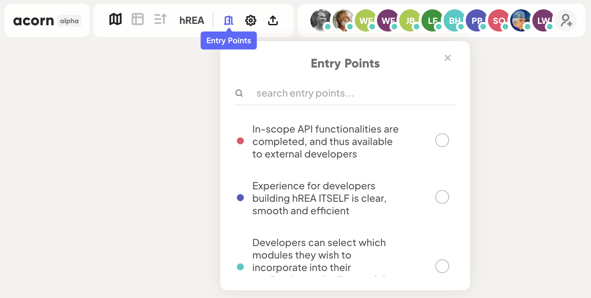

# Entry Point Outcomes

You can mark an Outcome as being an "Entry Point" to make it a point of access in the project, which you can jump to directly from the [Projects Dashboard](../projects/projects-dashboard.md). You can have more than one Entry Point at once in your project.

When an Outcome is marked as Entry Point it will:

* appear in you Projects Dashboard under your project's Entry Points list.
* in project's Map View, will appear in Entry Points list, which can be accessed by clicking on the **Entry Points Icon (Doorway)** on the top left header.&#x20;

## Marking or unmarking an Outcome as Entry Point 

To mark or unmark an Outcome as Entry Point, do one of the following:

* **In Table View**
  1. Click on the Outcome's Statement to open the Expanded View for that Outcome.&#x20;
  2. On the right column under the **Mark As** section check or uncheck the Entry Point option.
* **In Map View**
  1. Double click on the Outcome card to open the Expanded View for that Outcome.&#x20;
  2. On the right column under the **Mark As** section check or uncheck the Entry Point option.&#x20;

